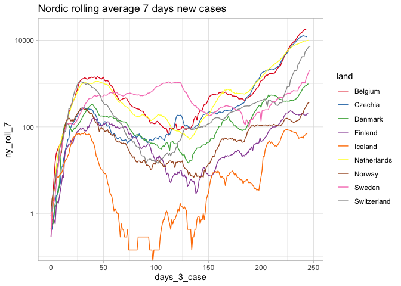
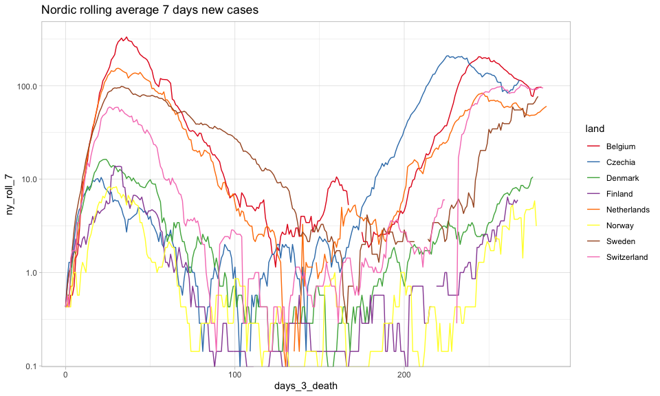
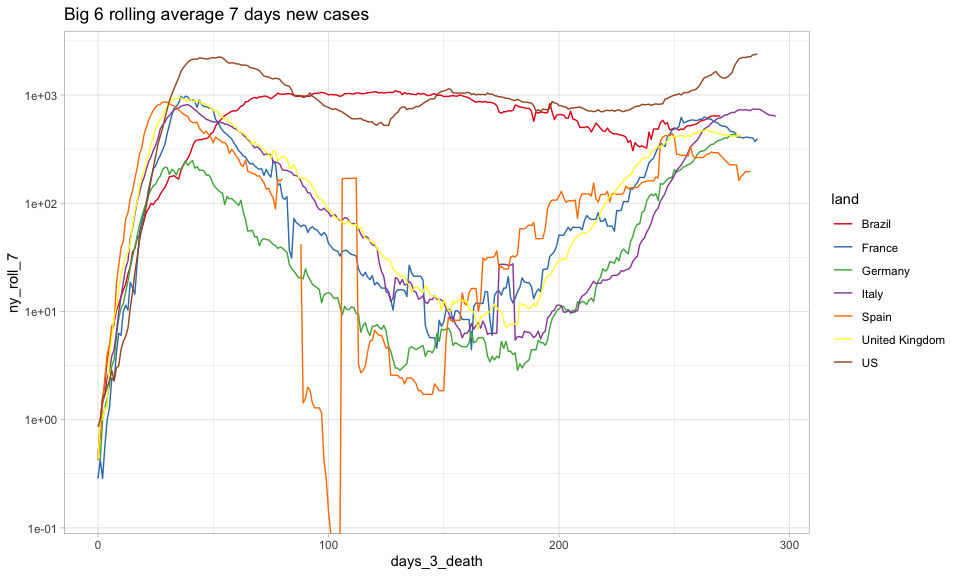

*Af: Emil Thranholm*

*Tallene viser de registerende tal per 15-11-2020*

Denne rapport følger udviklingen i corona-situationen på baggrund af
udvalgte tabeller med nøgletal og figurer. Det primære fokus i denne
rapport på udviklingen i Europa.

Udvikling i antal smittede
--------------------------

### Nøgletal

Denne tabel præsenterer antallet af smittede og vigtigere nye
smittefilfælde registret: 15-11-2020. I denne første tabel er fokus på
de nordiske lande samt udvalge mindre europæiske land. Ønsker til
tilføjelse af specifikke lande kan skrives til:
<ethranholm@hotmail.com>.

##### Tabel 1: Nordiske og udvalgte europæiske lande smittetilfælde

    ## # A tibble: 9 x 7
    ## # Groups:   land [9]
    ##   land        confirmed udv_confirmed roll_7_tot roll_3_tot ny_roll_7 ny_roll_3
    ##   <chr>           <int>         <int>      <dbl>      <dbl>     <dbl>     <dbl>
    ## 1 Netherlands    454961          5460    437828.    449332.    5451.    5862.  
    ## 2 Belgium        535939          4659    519810.    530744.    5021.    5182   
    ## 3 Czechia        460116          1887    443559.    457458.    6470.    4480.  
    ## 4 Denmark         62652          1059     59512.     61587.    1002.    1058   
    ## 5 Finland         19315           213     18594.     19092.     217.     258.  
    ## 6 Iceland          5189             3      5152.      5182.      15.9      9.67
    ## 7 Norway          28434             0     27105      28261.     529.     402   
    ## 8 Sweden         177355             0    168405.    177355     4413.    1997.  
    ## 9 Switzerland    257135             0    247100.    257135     6460.    2246.

Confirmed er antallet af smittetilfælde i alt siden januar.
Udv\_confirmed er antallet af nye smittetilfælde 15-11-2020.

Følgende tabel viser de 15 lande med det højeste registrede nye
tilfælde:

##### Tabel 2: Top 15 i verden smittetilfælde

    ## # A tibble: 15 x 7
    ## # Groups:   land [15]
    ##    land  confirmed udv_confirmed per_cap100k_tot rejse_vej per_cap100k
    ##    <chr>     <int>         <int>           <dbl>     <dbl>       <dbl>
    ##  1 US     11036935        133045           3378.     250.        40.7 
    ##  2 Italy   1178529         33977           1951.     370.        56.2 
    ##  3 India   8845127         30548            654.      23.5        2.26
    ##  4 Unit…   1372884         24977           2066.     244.        37.6 
    ##  5 Russ…   1910149         22313           1322.      94.6       15.4 
    ##  6 Pola…    712972         21854           1877.     422.        57.5 
    ##  7 Braz…   5863093         14134           2799.      68.7        6.75
    ##  8 Iran     762068         12543            932.      79.2       15.3 
    ##  9 Ukra…    551533         10940           1236.     150.        24.5 
    ## 10 Colo…   1198746          7112           2414.     121.        14.3 
    ## 11 Roma…    360281          7096           1851.     269.        36.5 
    ## 12 Port…    217301          6035           2113.     323.        58.7 
    ## 13 Aust…    203956          5665           2307.     488.        64.1 
    ## 14 Arge…   1310491          5645           2945.     159.        12.7 
    ## 15 Neth…    454961          5460           2640.     292.        31.7 
    ## # … with 1 more variable: per_cap_roll7 <dbl>

### Grafer og kort

Smitteudviklingen illustreres ved hjælp af flere grafer og kort
nedenfor.

##### Figur 1: Graf over nye smittetilfælde nordisk lande og udvalgte europæiske lande, 7 dages rullende gennemsnit

Vær opmærksom på at y-aksen af logaritme transformert. X-aksen viser
antal dage siden 3 smittetilfælde.

##### Figur 2: Graf over nye tilfælde store lande, 7 dages rullende gennemsnit

Denne figur viser de store europæiske lande samt USA og Brasilien.
Y-aksen er logaritme transformeret og x-aksen er dage siden 3
smittetilfælde

##### Figur 3: Graf over nye tilfælde lande med 10 flest nye tilfælde, 7 dages rullende gennemsnit

Denne figur viser et 7 dages rullende gennemsnit af nye tilfælde for de
10 lande med flest nye smittetilfælde 15-11-2020.

#### Smitteudvikling i hele Europa

I følgende figur er y-aksen logaritme transformere, mens x-aksen er
antal dage siden 1000 registrerede smittetilfælde

##### Figur 4: Hele Europa, 7 dages rullende gennemsnit

Følgende figur er samme som ovenstående men med fokus på øverste højre
hjørne.

##### Figur 5: Hele Europa fokuseret, 7 dages rullende gennemsnit

### Den danske rejsevejledning

Danmarks rejsevejledninger bliver lavet på baggrund af en vurdering af
smittetrykket i de enkelte lande (og om andre lande har restriktioner
mod Danmark). Her fokuseres udelukkende på smittetrykket. Smittetrykket
måles som antallet af smittede pr. 100.000 indbyggere per uge målt som
gennemsnit over 14 dage. Er smittetrykket over 30 frarådes alle
ikke-nødvendige rejser, mens landet “åbnes” igen ved et smittetryk på 20
eller under.

Følgende graf viser udviklingen i smittetrykket i de europæiske lande.
Notér, at x-aksen er dage efter 1000 cases, mens y-aksen er logaritme
transformeret. Den røde linje markerer et smittetryk på 30, som er den
danske grænse for at der frarådes ikke-nødvendige rejser til landet.
Mens den grønne linje ved smittetryk 20 markerer den grænse landet skal
være under for at der igen åbnes for rejser.

##### Figur 6: Udvikling i smittetrykket i Europa, smittede per 100.000 per uge målt som gennemsnit over 14 dage

Følgende kort viser smittetrykket i de europæiske lande.

##### Kort 1: Smittetryk i Europa, smittede per 100.000 per uge målt som gennemsnit over 14 dage

Nedenstående kort viser udviklingen i smittetrykket. Tallene er
forskellen mellem det nuværende smittetryk og smittetrykket for en uge
siden. Derfor kan det en indikation om smitten stiger eller falder og
med hvilken hastighed. Tal over 0 betyder en stigende smitte, tal under
0 er en aftagende smitte. Dette siger dog ikke noget om det totale
smitteniveau, eksempelvis kan man godt have aftagende smitte, men stadig
et højt smittetryk. Det kort kan mere bruges til vurdere og det går i en
positiv eller negativ retning.

##### Kort 2: udvikling i smittetryk

Udvikling i dødsfald
====================

Nedenstående tabel viser udvikling i dødsfald i udv\_deaths 15-11-2020
og total antal dødsfald i deaths. Første tabel viser det for udvalgte
mindre Europæiske lande, mens det efterfølgende viser på verdensplan.

##### Tabel 3: Udvikling i dødsfald udvalgte europæiske lande

    ## # A tibble: 9 x 7
    ## # Groups:   land [9]
    ##   land        deaths udv_deaths roll_7_tot roll_3_tot ny_roll_7 ny_roll_3
    ##   <chr>        <int>      <int>      <dbl>      <dbl>     <dbl>     <dbl>
    ## 1 Czechia       6208        150     5695.       6064    193.       151   
    ## 2 Belgium      14421        118    13894.      14277.   195.       177.  
    ## 3 Netherlands   8559         43     8356.       8502.    69.6       61.3 
    ## 4 Switzerland   3369         18     3183.       3345     85.3       51   
    ## 5 Denmark        760          3      754         758.     2.43       1.67
    ## 6 Finland        369          0      366.        369      1          1.33
    ## 7 Iceland         25          0       24.4        25      0.714      0   
    ## 8 Norway         294          0      290.        294      1.29       1   
    ## 9 Sweden        6164          0     6111.       6164     20.3       14

##### Tabel 4: Udvikling i dødsfald, flest nye dødsfald verdensplan

    ## # A tibble: 15 x 7
    ## # Groups:   land [15]
    ##    land           deaths udv_deaths roll_7_tot roll_3_tot ny_roll_7 ny_roll_3
    ##    <chr>           <int>      <int>      <dbl>      <dbl>     <dbl>     <dbl>
    ##  1 US             246214        616    243013.    245381.    1103.      1007.
    ##  2 Italy           45229        546     43525.     44684.     548.       547.
    ##  3 Iran            41493        459     40121.     41036.     457.       457.
    ##  4 India          130070        435    128616     129631      494.       467.
    ##  5 Russia          32885        349     31729      32526.     370.       377.
    ##  6 Poland          10348        303      9171       9964      354.       423.
    ##  7 Mexico          98542        283     96997.     98142.     502.       495.
    ##  8 Colombia        34031        202     33491.     33843      177.       180 
    ##  9 United Kingdom  52026        168     50850.     51760      413.       335.
    ## 10 Czechia          6208        150      5695.      6064      193.       151 
    ## 11 Brazil         165798        140    164182.    165398.     486.       506.
    ## 12 Argentina       35436        129     34742.     35263.     268        218 
    ## 13 Belgium         14421        118     13894.     14277.     195.       177.
    ## 14 Romania          8926        113      8502.      8808.     150.       139.
    ## 15 Hungary          3097        107      2791.      2990       94.1      104.

Figurerne nedenfor viser nye dødsfald som rullende 7-dages gennemsnit.
X-aksen er antal dage siden 3 dødsfald og y-aksen er logaritme
transformeret.

##### Figur 6: Udvikling nye dødsfald udvalgte europæiske lande, 7-dages rullende gennemsnit

##### Figur 7: Udvikling nye dødsfald udvalgte store lande, 7-dages rullende gennemsnit

Følgende tabel er sorteret efter antal dødsfald per 100.000 indbyggere

##### Tabel 5: Dødsfald per 100.000 indbyggere

    ## # A tibble: 30 x 4
    ## # Groups:   land [30]
    ##    land                   deaths udv_deaths per_cap100k_tot
    ##    <chr>                   <int>      <int>           <dbl>
    ##  1 Belgium                 14421        118           126. 
    ##  2 San Marino                 42          0           124. 
    ##  3 Peru                    35177         71           110. 
    ##  4 Andorra                    76          1            98.7
    ##  5 Spain                   40769          0            87.1
    ##  6 Argentina               35436        129            79.6
    ##  7 Brazil                 165798        140            79.2
    ##  8 Chile                   14819         42            79.1
    ##  9 United Kingdom          52026        168            78.3
    ## 10 Mexico                  98542        283            78.1
    ## 11 Bolivia                  8849          8            77.9
    ## 12 Ecuador                 13008         11            76.1
    ## 13 US                     246214        616            75.4
    ## 14 Italy                   45229        546            74.9
    ## 15 Moldova                  2019         13            74.6
    ## 16 Panama                   2873          6            68.8
    ## 17 Colombia                34031        202            68.5
    ## 18 France                  42601          1            63.6
    ## 19 North Macedonia          1305         24            62.6
    ## 20 Sweden                   6164          0            60.6
    ## 21 Armenia                  1763         25            59.7
    ## 22 Czechia                  6208        150            58.4
    ## 23 Bosnia and Herzegovina   1889         32            56.8
    ## 24 Iran                    41493        459            50.7
    ## 25 Netherlands              8559         43            49.7
    ## 26 Romania                  8926        113            45.9
    ## 27 Ireland                  1979          1            40.7
    ## 28 Bahamas                   156          1            40.5
    ## 29 Switzerland              3369         18            39.6
    ## 30 Slovenia                  797         32            38.4
