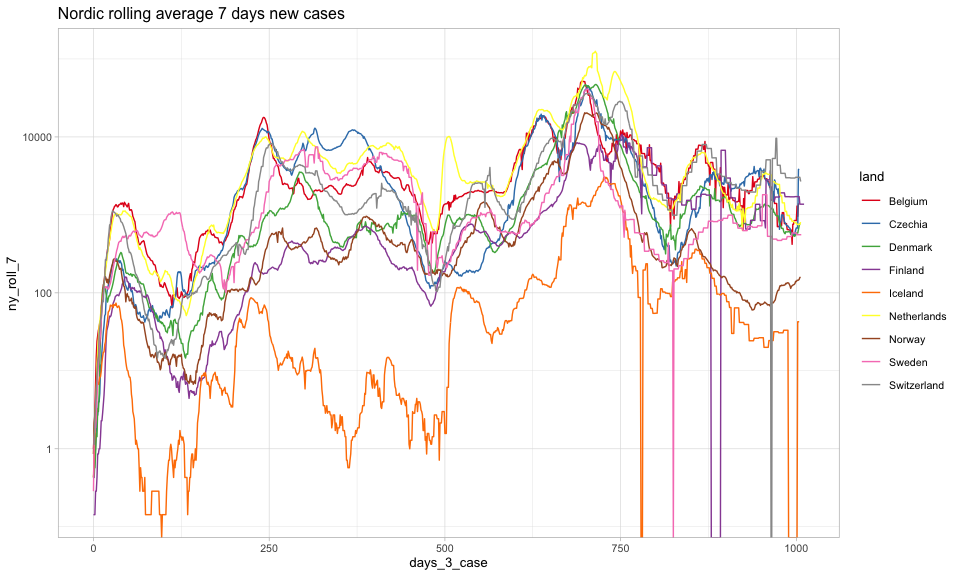

Emils corona-blog
=================

*Tallene viser de registerende tal per 10-08-2022*

*kilder:*

*<a href="https://github.com/pomber/covid19" class="uri">https://github.com/pomber/covid19</a>*

*<a href="https://github.com/owid/covid-19-data/blob/master/public/data/README.md" class="uri">https://github.com/owid/covid-19-data/blob/master/public/data/README.md</a>*

Denne rapport følger udviklingen i corona-situationen på baggrund af
udvalgte tabeller med nøgletal og figurer. Det primære fokus i denne
rapport på udviklingen i Europa.

*note: ikke alle kommentarer til tabeller er retvisende på nuværende
tidspunkt, da koden er blevet opdateret for at forbedre tabel-layout og
titler, mens teksten stadig mangler gennemgang*

Udvikling i antal smittede
--------------------------

### Nøgletal

Denne tabel præsenterer antallet af smittede og vigtigere nye
smittefilfælde registret: 10-08-2022. I denne første tabel er fokus på
de nordiske lande samt udvalge mindre europæiske land. Ønsker til
tilføjelse af specifikke lande kan skrives til:
<ethranholm@hotmail.com>.

##### Tabel 1: Nordiske og udvalgte europæiske lande smittetilfælde

|     | Land        |  Total antal smittede|  Nye smittetilfælde|  Nye tilfælde per 100.000|  Nye tilfælde per 100.000, 7 dages rullende gennemsnit|
|-----|:------------|---------------------:|-------------------:|-------------------------:|------------------------------------------------------:|
| 1   | Austria     |             4.848.736|               5.893|                      66,7|                                                   67,1|
| 2   | Czechia     |             4.005.046|               2.430|                      22,9|                                                   14,5|
| 3   | Netherlands |             8.468.285|               2.375|                      13,8|                                                   12,0|
| 4   | Denmark     |             3.294.667|               2.140|                      36,9|                                                   26,2|
| 5   | Norway      |             1.457.587|                 202|                       3,8|                                                    2,9|
| 6   | Belgium     |             4.444.819|                   0|                       0,0|                                                   24,5|
| 7   | Finland     |             1.218.216|                   0|                       0,0|                                                  122,2|
| 8   | Iceland     |               203.162|                   0|                       0,0|                                                   26,7|
| 9   | Sweden      |             2.545.671|                   0|                       0,0|                                                    8,4|
| 10  | Switzerland |             3.994.397|                   0|                       0,0|                                                   36,5|

Confirmed er antallet af smittetilfælde i alt siden januar.
Udv\_confirmed er antallet af nye smittetilfælde 10-08-2022.

Følgende tabel viser de 15 lande med det højeste registrede nye
smittetilfælde:

##### Tabel 2: Top 15 i verden smittetilfælde

|     | Land           |  Total antal smittede|  Nye smittetilfælde|  Nye tilfælde per 100.000|  Nye tilfælde per 100.000, 7 dages rullende gennemsnit|
|-----|:---------------|---------------------:|-------------------:|-------------------------:|------------------------------------------------------:|
| 1   | Japan          |            14.886.036|             250.288|                     197,8|                                                  170,1|
| 2   | US             |            92.562.177|             220.566|                      67,5|                                                   33,3|
| 3   | Korea South    |            20.983.169|             137.196|                     265,8|                                                  227,8|
| 4   | Germany        |            31.439.645|              59.888|                      72,2|                                                   55,2|
| 5   | United Kingdom |            23.634.561|              52.558|                      79,1|                                                   11,5|
| 6   | Italy          |            21.400.179|              31.699|                      52,5|                                                   54,3|
| 7   | France         |            34.359.013|              27.288|                      40,7|                                                   39,7|
| 8   | Taiwan         |             4.801.676|              23.773|                        NA|                                                     NA|
| 9   | Russia         |            18.497.489|              23.549|                      16,3|                                                   13,1|
| 10  | Australia      |             9.729.634|              19.917|                      79,7|                                                  100,2|
| 11  | Hungary        |             2.005.399|              18.078|                     184,9|                                                   26,4|
| 12  | India          |            44.206.996|              16.299|                       1,2|                                                    1,3|
| 13  | Chile          |             4.331.416|              11.243|                      60,0|                                                   52,2|
| 14  | Moldova        |               551.862|              10.147|                     375,0|                                                   53,6|
| 15  | Romania        |             3.137.858|               7.313|                      37,6|                                                   35,4|

Tabellen nedenfor viser udvikling i smittede for de lande, der er flest
nye tilfælde per 100.000. Dog afgrænset til lande, hvor befolkningen er
større end 1 mio.

##### Tabel 3: Top 15 i verden smittetilfælde per 100.000

|     | Land           |  Total antal smittede|  Nye smittetilfælde|  Nye tilfælde per 100.000|  Nye tilfælde per 100.000, 7 dages rullende gennemsnit|
|-----|:---------------|---------------------:|-------------------:|-------------------------:|------------------------------------------------------:|
| 1   | Moldova        |               551.862|              10.147|                     375,0|                                                   53,6|
| 2   | Korea South    |            20.983.169|             137.196|                     265,8|                                                  227,8|
| 3   | Japan          |            14.886.036|             250.288|                     197,8|                                                  170,1|
| 4   | Hungary        |             2.005.399|              18.078|                     184,9|                                                   26,4|
| 5   | New Zealand    |             1.683.073|               5.016|                     103,6|                                                  102,2|
| 6   | Serbia         |             2.185.259|               7.061|                     101,4|                                                   88,4|
| 7   | Latvia         |               877.702|               1.881|                      97,6|                                                   73,3|
| 8   | Slovenia       |             1.098.327|               1.821|                      87,8|                                                   69,7|
| 9   | Australia      |             9.729.634|              19.917|                      79,7|                                                  100,2|
| 10  | United Kingdom |            23.634.561|              52.558|                      79,1|                                                   11,5|
| 11  | Germany        |            31.439.645|              59.888|                      72,2|                                                   55,2|
| 12  | Mongolia       |               964.649|               2.155|                      68,0|                                                   58,2|
| 13  | US             |            92.562.177|             220.566|                      67,5|                                                   33,3|
| 14  | Austria        |             4.848.736|               5.893|                      66,7|                                                   67,1|
| 15  | Lithuania      |             1.195.813|               1.858|                      66,3|                                                   43,9|

### Grafer og kort

Smitteudviklingen illustreres ved hjælp af flere grafer og kort
nedenfor.

##### Figur 1: Graf over nye smittetilfælde nordisk lande og udvalgte europæiske lande, 7 dages rullende gennemsnit

Vær opmærksom på at y-aksen af logaritme transformert. X-aksen viser
antal dage siden 3 smittetilfælde.

##### Figur 2: Graf over nye tilfælde store lande, 7 dages rullende gennemsnit

Denne figur viser de store europæiske lande samt USA og Brasilien.
Y-aksen er logaritme transformeret og x-aksen er dage siden 3
smittetilfælde

##### Figur 3: Graf over nye tilfælde lande med 10 flest nye tilfælde, 7 dages rullende gennemsnit

Denne figur viser et 7 dages rullende gennemsnit af nye tilfælde for de
10 lande med flest nye smittetilfælde 10-08-2022.

#### Smitteudvikling i hele Europa

I følgende figur er y-aksen logaritme transformere, mens x-aksen er
antal dage siden 1000 registrerede smittetilfælde

##### Figur 4: Hele Europa, 7 dages rullende gennemsnit

Følgende figur er samme som ovenstående men med fokus på øverste højre
hjørne.

##### Figur 5: Hele Europa fokuseret, 7 dages rullende gennemsnit

### Den danske rejsevejledning

Danmarks rejsevejledninger bliver lavet på baggrund af en vurdering af
smittetrykket i de enkelte lande (og om andre lande har restriktioner
mod Danmark). Her fokuseres udelukkende på smittetrykket. Smittetrykket
måles som antallet af smittede pr. 100.000 indbyggere per uge målt som
gennemsnit over 14 dage. Er smittetrykket over 30 frarådes alle
ikke-nødvendige rejser, mens landet “åbnes” igen ved et smittetryk på 20
eller under.

Følgende graf viser udviklingen i smittetrykket i de europæiske lande.
Notér, at x-aksen er dage efter 1000 cases, mens y-aksen er logaritme
transformeret. Den røde linje markerer et smittetryk på 30, som er den
danske grænse for at der frarådes ikke-nødvendige rejser til landet.
Mens den grønne linje ved smittetryk 20 markerer den grænse landet skal
være under for at der igen åbnes for rejser.

I enkelte tilfælde er der lande, der nedjusterer antallet af smittede,
således at antallet af nye smittede kan på dagen for nedjusteringen
blive negativ. I disse tilfælde er der manuelt sat et 0 som antallet af
nye smittede, da de negative nye smittede kan have ret stor påvirkning
på tallene, der udregnes over længere tidsperioder. Et eksempel er
Spanien, der 2. marts nedjusterede det samlede antal smittede med
omkring 75.000.

OBS: smittetallene er påvirket af testaktiviteten i de forskellige
lande. Danmark ligger på en klar førsteplads i test blandt landene i
Europa, hvorfor de danske tal vil være en smule overestimeret i forhold
til lande med lavere testaktivitet. Derfor er det totale smittetryk i
alle lande muligvis ikke retvisende, dog kan tabellerne med udviklingen
i smittetryk give en god indikator for udviklingen af smitte i de
enkelte lande.

##### Figur 6: Udvikling i smittetrykket i Europa, smittede per 100.000 per uge målt som gennemsnit over 14 dage

Følgende kort viser smittetrykket i de europæiske lande.

##### Kort 1: Smittetryk i Europa, smittede per 100.000 per uge målt som gennemsnit over 14 dage

Nedenstående kort viser udviklingen i smittetrykket. Tallene er
forskellen mellem det nuværende smittetryk og smittetrykket for en uge
siden. Derfor kan det en indikation om smitten stiger eller falder og
med hvilken hastighed. Tal over 0 betyder en stigende smitte, tal under
0 er en aftagende smitte. Dette siger dog ikke noget om det totale
smitteniveau, eksempelvis kan man godt have aftagende smitte, men stadig
et højt smittetryk. Det kort kan mere bruges til vurdere og det går i en
positiv eller negativ retning.

##### Kort 2: udvikling i smittetryk, 7 dage siden

Nedenstående kort viser udviklingen i smittetrykket sammenlignet med i
går. Her skal man dog være opmærksom på, at denne kan være mere følsom
overfor registreringer end kort 2 ovenfor, hvor der sammenlignes med
smittetrykket for en uge siden. Helt konkret er der nogle lande, hvor
der ikke registreres antal smittetilfælde i weekenderne, men
offentliggøre så tal for hele weekenden mandag eller tirsdag, det kan få
nogle lande til at slå mere ud på bestemte dage (Sverige registrerer på
nuværende tidspunkt ikke nye smittede i weekenderne, men først samlet
mandag eller tirsdag). Dog med de forbehold kan dette kort give en
indikation på, hvor hurtigt smitten er stigende eller aftagende.

##### Kort 3: Udvikling i smittetryk sammenlignet med i går

### Positiv procent

Kortet nedenfor viser seneste registrerede positiv-procent for de
europæiske lande. Det bør noteres at tallene er forbundet med en vis
usikkerhed, da der ikke er samme systematik i indmeldelse af antallet
test sammenlignet med antallet af smittede og dødsfald. Derfor er
tallene i mange tilfælde indhentet gennem landenes sundhedsmyndigheder,
der offentliggøre tallene på forskellig vis og med forskellige frekvens.
Der kan læses nærmere om dataen fra kilden her:
<a href="https://github.com/owid/covid-19-data/blob/master/public/data/README.md" class="uri">https://github.com/owid/covid-19-data/blob/master/public/data/README.md</a>

Grundet de forskellige tidspunkter for indberetning af test, så kan der
opstår tilfælde hvor test bliver offentliggjort lørdag, hvor antallet af
smittede først opdateres efter weekenden. Dette kan føre til meget høje
positive procenter og misvisende procenter for de enkelte dage. Derfor
er positiv procenterne udregnet som et gennemsnit over de seneste 7 dage
med tilgængelig data. Dette betyder at tallene for nogle lande kan lidt
gamle, dog maksimalt en måned gamle. Kortet kan være lidt mangelfuldt
omkring månedsskifte. Der arbejdes på noget smartere.

##### Kort 4: Positiv procent

Udvikling i dødsfald
====================

Nedenstående tabel viser udvikling i dødsfald i udv\_deaths 10-08-2022
og total antal dødsfald i deaths. Første tabel viser det for udvalgte
mindre Europæiske lande, mens det efterfølgende viser på verdensplan.

##### Tabel 4: Udvikling i dødsfald udvalgte europæiske lande

|     | Land        |  Total antal dødsfald|  Nye dødsfald|  Nye dødsfald, 7 dages rullende gennemsnit|
|-----|:------------|---------------------:|-------------:|------------------------------------------:|
| 1   | Austria     |                20.460|            19|                                       10,0|
| 2   | Denmark     |                 6.823|            16|                                       12,4|
| 3   | Czechia     |                40.601|            14|                                       10,0|
| 4   | Switzerland |                13.938|            13|                                        3,0|
| 5   | Netherlands |                23.169|             5|                                        4,4|
| 6   | Belgium     |                32.329|             0|                                        9,4|
| 7   | Finland     |                 5.251|             0|                                       34,1|
| 8   | Iceland     |                   179|             0|                                        0,0|
| 9   | Norway      |                 3.834|             0|                                       30,1|
| 10  | Sweden      |                19.433|             0|                                       10,7|

##### Tabel 5: Udvikling i dødsfald, flest nye dødsfald verdensplan

|     | Land           |  Total antal dødsfald|  Nye dødsfald|  Nye dødsfald, 7 dages rullende gennemsnit|
|-----|:---------------|---------------------:|-------------:|------------------------------------------:|
| 1   | United Kingdom |               186.798|         1.037|                                      148,6|
| 2   | US             |             1.035.548|           927|                                      474,9|
| 3   | Japan          |                34.373|           251|                                      194,0|
| 4   | Germany        |               145.394|           153|                                      120,3|
| 5   | Italy          |               173.571|           145|                                      143,3|
| 6   | Iran           |               142.654|            90|                                       63,6|
| 7   | France         |               153.950|            88|                                       77,1|
| 8   | Hungary        |                46.966|            80|                                       11,4|
| 9   | Korea South    |                25.441|            59|                                       42,4|
| 10  | Australia      |                12.617|            57|                                       72,3|
| 11  | Russia         |               375.140|            55|                                       47,6|
| 12  | India          |               526.879|            53|                                       49,9|
| 13  | Tunisia        |                29.153|            48|                                        6,9|
| 14  | Ireland        |                 7.743|            43|                                        6,1|
| 15  | Canada         |                43.228|            40|                                       32,6|

Figurerne nedenfor viser nye dødsfald som rullende 7-dages gennemsnit.
X-aksen er antal dage siden 3 dødsfald og y-aksen er logaritme
transformeret.

##### Figur 6: Udvikling nye dødsfald udvalgte europæiske lande, 7-dages rullende gennemsnit

##### Figur 7: Udvikling nye dødsfald udvalgte store lande, 7-dages rullende gennemsnit

Følgende tabel er sorteret efter antal dødsfald per 100.000 indbyggere:

##### Tabel 6: Dødsfald per 100.000 indbyggere

|     | Land                   |  Total dødsfald|  Nye dødsfald|  Dødsfald per 100.000|
|-----|:-----------------------|---------------:|-------------:|---------------------:|
| 1   | Peru                   |         214.739|             0|                 671,3|
| 2   | Bulgaria               |          37.469|             9|                 533,4|
| 3   | Hungary                |          46.966|            80|                 480,4|
| 4   | Bosnia and Herzegovina |          15.933|             3|                 479,3|
| 5   | Georgia                |          16.869|             0|                 452,7|
| 6   | North Macedonia        |           9.400|             2|                 451,0|
| 7   | Moldova                |          11.662|            32|                 431,0|
| 8   | Croatia                |          16.446|            12|                 402,3|
| 9   | Czechia                |          40.601|            14|                 381,9|
| 10  | Slovakia               |          20.236|             0|                 371,5|
| 11  | San Marino             |             118|             0|                 349,3|
| 12  | Romania                |          66.262|            26|                 340,4|
| 13  | Lithuania              |           9.227|             1|                 329,4|
| 14  | Slovenia               |           6.738|             6|                 324,9|
| 15  | Brazil                 |         680.531|             0|                 324,9|
| 16  | Chile                  |          59.845|             5|                 319,5|
| 17  | US                     |       1.035.548|           927|                 317,0|
| 18  | Poland                 |         116.717|            31|                 307,4|
| 19  | Latvia                 |           5.908|             3|                 306,6|
| 20  | Greece                 |          31.722|             0|                 295,6|
| 21  | Trinidad and Tobago    |           4.070|             0|                 292,8|
| 22  | Armenia                |           8.637|             0|                 292,6|
| 23  | Argentina              |         129.440|             0|                 290,9|
| 24  | Italy                  |         173.571|           145|                 287,3|
| 25  | Colombia               |         141.075|             0|                 284,1|
| 26  | Belgium                |          32.329|             0|                 282,8|
| 27  | United Kingdom         |         186.798|         1.037|                 281,1|
| 28  | Paraguay               |          19.289|             0|                 277,3|
| 29  | Ukraine                |         116.489|             1|                 261,1|
| 30  | Mexico                 |         328.437|             0|                 260,3|

*af: Emil Thranholm, mail: <ethranholm@hotmail.com>*
