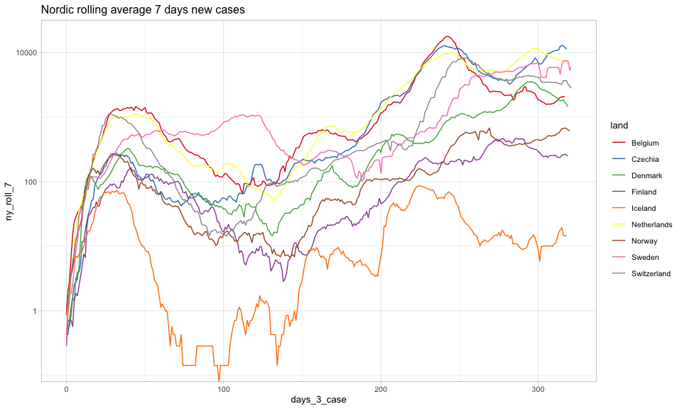

*Af: Emil Thranholm*

*Tallene viser de registerende tal per 11-11-2020*

Denne rapport følger udviklingen i corona-situationen på baggrund af
udvalgte tabeller med nøgletal og figurer. Det primære fokus i denne
rapport på udviklingen i Europa.

Udvikling i antal smittede
--------------------------

### Nøgletal

Denne tabel præsenterer antallet af smittede og vigtigere nye
smittefilfælde registret: 11-11-2020. I denne første tabel er fokus på
de nordiske lande samt udvalge mindre europæiske land. Ønsker til
tilføjelse af specifikke lande kan skrives til:
<ethranholm@hotmail.com>.

##### Tabel 1: Nordiske og udvalgte europæiske lande smittetilfælde

    ## # A tibble: 9 x 7
    ## # Groups:   land [9]
    ##   land        confirmed udv_confirmed roll_7_tot roll_3_tot ny_roll_7 ny_roll_3
    ##   <chr>           <int>         <int>      <dbl>      <dbl>     <dbl>     <dbl>
    ## 1 Czechia        438805          8925    415337.    428622     8584.     7992. 
    ## 2 Switzerland    243472          8270    220877     235965.    7299.    10520. 
    ## 3 Belgium        515391          7916    498341.    508683.    6740.     4867. 
    ## 4 Netherlands    431696          5469    415549     426475.    5939.     4963. 
    ## 5 Sweden         166707          4467    150936.    158469.    4140.     6749. 
    ## 6 Denmark         58466           994     55525.     57448     1061.      944. 
    ## 7 Norway          26511           624     24823.     25908.     562.      593  
    ## 8 Finland         18345           238     17718.     18113      202.      183. 
    ## 9 Iceland          5142            28      5079.      5119       21.9      21.3

Confirmed er antallet af smittetilfælde i alt siden januar.
Udv\_confirmed er antallet af nye smittetilfælde 11-11-2020.

Følgende tabel viser de 15 lande med det højeste registrede nye
tilfælde:

##### Tabel 2: Top 15 i verden smittetilfælde

    ## # A tibble: 15 x 7
    ## # Groups:   land [15]
    ##    land  confirmed udv_confirmed per_cap100k_tot rejse_vej per_cap100k
    ##    <chr>     <int>         <int>           <dbl>     <dbl>       <dbl>
    ##  1 US     10399325        143231           3183.     211.        43.8 
    ##  2 Fran…   1914918         57609           2859.     480.        86.0 
    ##  3 Braz…   5747660         48655           2744.      64.5       23.2 
    ##  4 India   8683916         47905            642.      23.9        3.54
    ##  5 Spain   1417709         36491           3030.     299.        78.0 
    ##  6 Italy   1028424         32961           1702.     335.        54.6 
    ##  7 Pola…    618813         25221           1630.     381.        66.4 
    ##  8 Unit…   1260198         23000           1896.     238.        34.6 
    ##  9 Germ…    738094         22401            890.     146.        27.0 
    ## 10 Russ…   1822345         19583           1261.      89.0       13.6 
    ## 11 Iran     715068         11780            874.      70.0       14.4 
    ## 12 Arge…   1273356         10880           2862.     171.        24.5 
    ## 13 Ukra…    504423         10879           1130.     135.        24.4 
    ## 14 Colo…   1165326          9970           2347.     127.        20.1 
    ## 15 Roma…    324094          9799           1665.     237.        50.3 
    ## # … with 1 more variable: per_cap_roll7 <dbl>

### Grafer og kort

Smitteudviklingen illustreres ved hjælp af flere grafer og kort
nedenfor.

##### Figur 1: Graf over nye smittetilfælde nordisk lande og udvalgte europæiske lande, 7 dages rullende gennemsnit

Vær opmærksom på at y-aksen af logaritme transformert. X-aksen viser
antal dage siden 3 smittetilfælde.

##### Figur 2: Graf over nye tilfælde store lande, 7 dages rullende gennemsnit

Denne figur viser de store europæiske lande samt USA og Brasilien.
Y-aksen er logaritme transformeret og x-aksen er dage siden 3
smittetilfælde

##### Figur 3: Graf over nye tilfælde lande med 10 flest nye tilfælde, 7 dages rullende gennemsnit

Denne figur viser et 7 dages rullende gennemsnit af nye tilfælde for de
10 lande med flest nye smittetilfælde 11-11-2020.

#### Smitteudvikling i hele Europa

I følgende figur er y-aksen logaritme transformere, mens x-aksen er
antal dage siden 1000 registrerede smittetilfælde

##### Figur 4: Hele Europa, 7 dages rullende gennemsnit

Følgende figur er samme som ovenstående men med fokus på øverste højre
hjørne.

##### Figur 5: Hele Europa fokuseret, 7 dages rullende gennemsnit

### Den danske rejsevejledning

Danmarks rejsevejledninger bliver lavet på baggrund af en vurdering af
smittetrykket i de enkelte lande (og om andre lande har restriktioner
mod Danmark). Her fokuseres udelukkende på smittetrykket. Smittetrykket
måles som antallet af smittede pr. 100.000 indbyggere per uge målt som
gennemsnit over 14 dage. Er smittetrykket over 30 frarådes alle
ikke-nødvendige rejser, mens landet “åbnes” igen ved et smittetryk på 20
eller under.

Følgende graf viser udviklingen i smittetrykket i de europæiske lande.
Notér, at x-aksen er dage efter 1000 cases, mens y-aksen er logaritme
transformeret. Den røde linje markerer et smittetryk på 30, som er den
danske grænse for at der frarådes ikke-nødvendige rejser til landet.
Mens den grønne linje ved smittetryk 20 markerer den grænse landet skal
være under for at der igen åbnes for rejser.

##### Figur 6: Udvikling i smittetrykket i Europa, smittede per 100.000 per uge målt som gennemsnit over 14 dage

Følgende kort viser smittetrykket i de europæiske lande.

##### Kort 1: Smittetryk i Europa, smittede per 100.000 per uge målt som gennemsnit over 14 dage

Nedenstående kort viser udviklingen i smittetrykket. Tallene er
forskellen mellem det nuværende smittetryk og smittetrykket for en uge
siden. Derfor kan det en indikation om smitten stiger eller falder og
med hvilken hastighed. Tal over 0 betyder en stigende smitte, tal under
0 er en aftagende smitte. Dette siger dog ikke noget om det totale
smitteniveau, eksempelvis kan man godt have aftagende smitte, men stadig
et højt smittetryk. Det kort kan mere bruges til vurdere og det går i en
positiv eller negativ retning.

##### Kort 2: udvikling i smittetryk

Udvikling i dødsfald
====================

Nedenstående tabel viser udvikling i dødsfald i udv\_deaths 11-11-2020
og total antal dødsfald i deaths. Første tabel viser det for udvalgte
mindre Europæiske lande, mens det efterfølgende viser på verdensplan.

##### Tabel 3: Udvikling i dødsfald udvalgte europæiske lande

    ## # A tibble: 9 x 7
    ## # Groups:   land [9]
    ##   land        deaths udv_deaths roll_7_tot roll_3_tot ny_roll_7 ny_roll_3
    ##   <chr>        <int>      <int>      <dbl>      <dbl>     <dbl>     <dbl>
    ## 1 Czechia       5570        247     4896.      5307     205.       237.  
    ## 2 Belgium      13758        197    13104.     13512.    204.       234.  
    ## 3 Switzerland   3113        100     2841       3009.     79.7      114.  
    ## 4 Netherlands   8286         75     8071.      8203      76.9       71.3 
    ## 5 Sweden        6082         25     6033.      6054.     12.1       20   
    ## 6 Denmark        753          3      743.       750       3.43       3.33
    ## 7 Finland        365          2      363.       364.      0.571      1   
    ## 8 Iceland         24          0       20.7       23.7     1          1.33
    ## 9 Norway         285          0      285.       285       0.429      0

##### Tabel 4: Udvikling i dødsfald, flest nye dødsfald verdensplan

    ## # A tibble: 15 x 7
    ## # Groups:   land [15]
    ##    land           deaths udv_deaths roll_7_tot roll_3_tot ny_roll_7 ny_roll_3
    ##    <chr>           <int>      <int>      <dbl>      <dbl>     <dbl>     <dbl>
    ##  1 US             241797       1892    238096.    240057      1120.     1339.
    ##  2 France          42599       1537     40632      41570       553       703 
    ##  3 Spain           40105        760     39111.     39598.      284.      424 
    ##  4 Italy           42953        623     41474.     42344.      456.      520.
    ##  5 United Kingdom  50457        596     49219.     49882.      375       441 
    ##  6 Mexico          96430        588     95033.     95766.      457.      468.
    ##  7 Brazil         163368        566    162369.    162933.      323.      324.
    ##  8 India          128121        550    126576.    127584.      544.      503.
    ##  9 Iran            39664        462     38305.     39205       441.      458.
    ## 10 Poland           8805        430      7837.      8408.      333.      311 
    ## 11 Russia          31326        427     30287.     30924.      333.      345.
    ## 12 Argentina       34531        348     33633      34207       287.      324.
    ## 13 Czechia          5570        247      4896.      5307       205.      237.
    ## 14 Germany         11994        213     11459.     11728.      149.      207.
    ## 15 Romania          8389        203      7923.      8195.      139.      170

Figurerne nedenfor viser nye dødsfald som rullende 7-dages gennemsnit.
X-aksen er antal dage siden 3 dødsfald og y-aksen er logaritme
transformeret.

##### Figur 6: Udvikling nye dødsfald udvalgte europæiske lande, 7-dages rullende gennemsnit

##### Figur 7: Udvikling nye dødsfald udvalgte store lande, 7-dages rullende gennemsnit

Følgende tabel er sorteret efter antal dødsfald per 100.000 indbyggere

##### Tabel 5: Dødsfald per 100.000 indbyggere

    ## # A tibble: 30 x 4
    ## # Groups:   land [30]
    ##    land                   deaths udv_deaths per_cap100k_tot
    ##    <chr>                   <int>      <int>           <dbl>
    ##  1 San Marino                 42          0           124. 
    ##  2 Belgium                 13758        197           120. 
    ##  3 Peru                    34992         49           109. 
    ##  4 Andorra                    75          0            97.4
    ##  5 Spain                   40105        760            85.7
    ##  6 Chile                   14633         22            78.1
    ##  7 Brazil                 163368        566            78.0
    ##  8 Bolivia                  8818         10            77.7
    ##  9 Argentina               34531        348            77.6
    ## 10 Mexico                  96430        588            76.4
    ## 11 United Kingdom          50457        596            75.9
    ## 12 Ecuador                 12920         71            75.6
    ## 13 US                     241797       1892            74.0
    ## 14 Moldova                  1950         20            72.1
    ## 15 Italy                   42953        623            71.1
    ## 16 Panama                   2823          6            67.6
    ## 17 Colombia                33312        184            67.1
    ## 18 France                  42599       1537            63.6
    ## 19 Sweden                   6082         25            59.8
    ## 20 North Macedonia          1212         26            58.1
    ## 21 Armenia                  1636         27            55.4
    ## 22 Czechia                  5570        247            52.4
    ## 23 Bosnia and Herzegovina   1701         72            51.2
    ## 24 Iran                    39664        462            48.5
    ## 25 Netherlands              8286         75            48.1
    ## 26 Romania                  8389        203            43.1
    ## 27 Ireland                  1965          2            40.4
    ## 28 Bahamas                   154          0            39.9
    ## 29 Switzerland              3113        100            36.6
    ## 30 South Africa            20011         60            34.6
